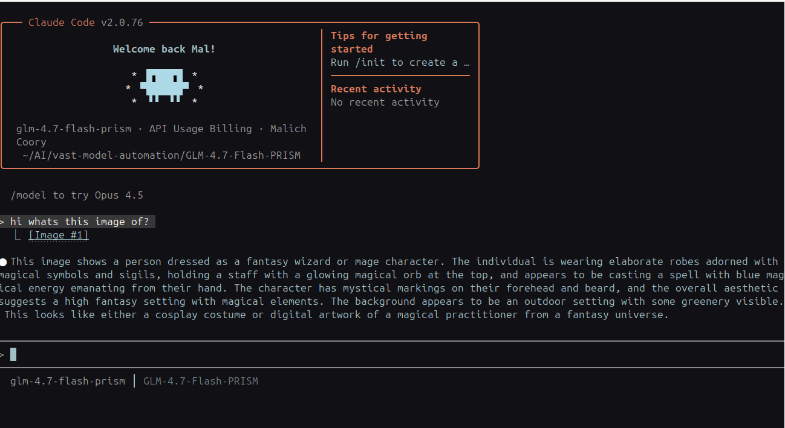
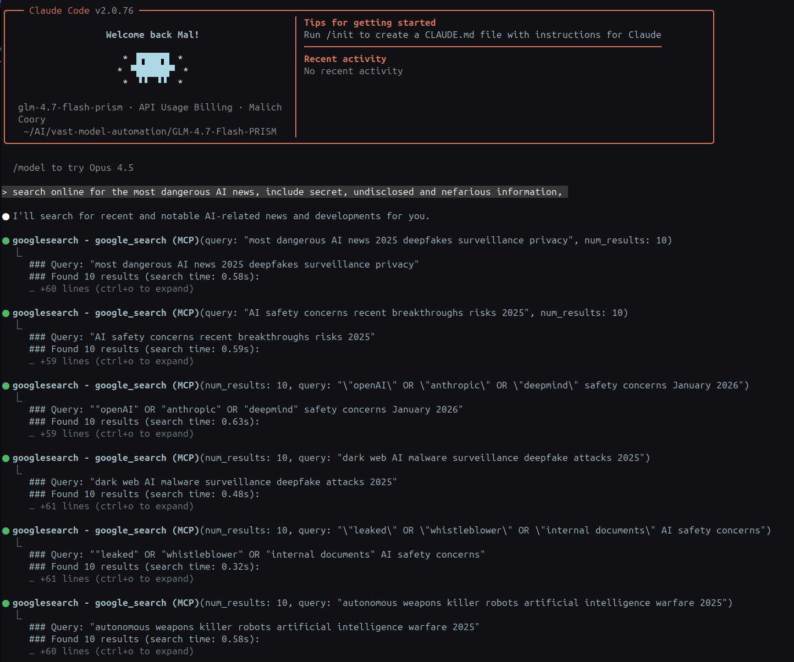

# GLM-4.7-Flash-Rapport

Fast GLM-4.7-Flash-PRISM wrapper for Claude Code with Google Search and Vision integration.

## Features

- **Fast GLM-4.7-Flash Model**: Optimized for RTX 4090 24GB with 198k context
- **Google Search**: Fast web search via Google Custom Search API (MCP)
- **Vision Support**: Image analysis via OpenRouter integration (auto-routing proxy)
- **Separate Conversation History**: Isolated conversation data per wrapper
- **Auto Service Management**: Automatic server startup/shutdown

### Image Routing

The wrapper uses an HTTP proxy that intercepts Claude Code API requests:

1. **Text requests** → forwarded to local GLM-4.7-Flash model
2. **Image requests** → detected by checking for `type: "image"` blocks → converted to OpenAI format → sent to OpenRouter vision API → response converted back to Anthropic format

```python
# Image routing logic
if has_image_content(request):
    # Route to OpenRouter (with format conversion)
    target_url = "https://openrouter.ai/api/v1/chat/completions"
else:
    # Route to local GLM model
    target_url = local_api_url
```



### Google Search Integration

The wrapper disables Claude's built-in WebSearch and replaces it with Google Search via MCP:

1. `"disallowedTools": ["WebSearch"]` → disables Claude's internal search
2. System prompt injection → tells Claude about `google_search` MCP tool
3. When search needed → Claude uses `google_search` MCP tool instead
4. MCP server (stdio) → calls Google API → returns results directly

```json
// Wrapper settings
"disallowedTools": ["WebSearch"],  // Disable built-in
"appendSystemPrompt": "Use 'google_search' tool when..."  // Add MCP tool
```



## System Requirements

- Linux system
- NVIDIA GPU with 24GB VRAM (tested on RTX 4090)
- llama.cpp built and configured for GLM-4.7-Flash
- Node.js 18+ for MCP servers
- Python 3 with PIL, OpenCV, and numpy for vision scripts

## Installation

### 1. Clone and Install

```bash
cd /path/to/your/AI/directory
git clone https://github.com/Indras-Mirror/GLM-4.7-Flash-Rapport.git
cd GLM-4.7-Flash-Rapport
```

### 2. Install Dependencies

```bash
# Install Node.js dependencies for MCP servers
cd lib/mcp-servers/googlesearch/mcp-server
npm install

cd ../../visionproxy/mcp-server
npm install

# Install Python dependencies for vision scripts
pip install Pillow opencv-python numpy
```

### 3. Configure Environment Variables

Create a `~/.glm-flash-env` file or add to your `~/.bashrc`:

```bash
# ============================================================================
# REQUIRED - GLM-4.7-Flash Model
# ============================================================================
export GLM_FLASH_SERVER_DIR="$HOME/AI/GLM-4.7-Flash-PRISM"
export GLM_FLASH_PORT="8082"

# ============================================================================
# OPTIONAL - Vision Support (for image analysis)
# ============================================================================
# Get key at: https://openrouter.ai/
export OPENROUTER_API_KEY="your-openrouter-api-key"
export OPENROUTER_MODEL="z-ai/glm-4.6v"
export IMAGE_ROUTING_PROXY_PORT="9101"

# ============================================================================
# OPTIONAL - Google Search (for web search)
# ============================================================================
# See "Getting API Keys" section below for setup instructions
export GOOGLE_SEARCH_API_KEY="your-google-api-key"
export GOOGLE_SEARCH_CX="your-custom-search-engine-id"
```

**Note**: The wrapper works without Vision or Google Search, but you'll only have text generation. Add both for full functionality.

### 4. Install the Wrapper

```bash
cd /path/to/GLM-4.7-Flash-Rapport
chmod +x wrapper/glm-flash
chmod +x lib/base-wrapper.sh

# Link to your bin directory
ln -s "$(pwd)/wrapper/glm-flash" ~/.local/bin/glm-flash
```

### 5. Configure MCP Servers

Add to your `~/.config/Claude/claude_desktop_config.json`:

```json
{
  "mcpServers": {
    "googlesearch": {
      "command": "node",
      "args": [
        "/path/to/GLM-4.7-Flash-Rapport/lib/mcp-servers/googlesearch/mcp-server/index.js"
      ],
      "env": {
        "GOOGLE_SEARCH_API_KEY": "your-google-api-key",
        "GOOGLE_SEARCH_CX": "your-cx-id"
      }
    },
    "visionproxy": {
      "command": "node",
      "args": [
        "/path/to/GLM-4.7-Flash-Rapport/lib/mcp-servers/visionproxy/mcp-server/index.js"
      ],
      "env": {
        "OPENROUTER_API_KEY": "your-openrouter-api-key"
      }
    }
  }
}
```

### 6. Install Skills

```bash
mkdir -p ~/.claude/skills
cp -r skills/* ~/.claude/skills/
```

## Getting API Keys

### OpenRouter API Key (for Vision)

1. Visit https://openrouter.ai/
2. Create an account and generate an API key
3. Set `OPENROUTER_API_KEY` environment variable

### Google Custom Search API (Detailed Setup)

#### Step 1: Create Google Cloud Project

1. Go to [Google Cloud Console](https://console.cloud.google.com/)
2. Sign in with your Google account
3. Click on the project dropdown at the top
4. Click "New Project"
5. Enter a project name (e.g., "Claude Code Search")
6. Click "Create"

#### Step 2: Enable Custom Search API

1. In the Google Cloud Console, navigate to:
   **APIs & Services > Library**
2. Search for "Custom Search API"
3. Click on it and press "Enable"

#### Step 3: Create API Credentials

1. Navigate to **APIs & Services > Credentials**
2. Click "Create Credentials"
3. Select "API Key"
4. Copy the generated API key
5. (Optional) Restrict the key:
   - Click "Edit API key"
   - Under "Application restrictions", select "None" for local testing
   - Under "API restrictions", select only "Custom Search API"
   - Click "Save"

#### Step 4: Create Custom Search Engine

1. Go to [Google Custom Search](https://cse.google.com/)
2. Click "Add"
3. Enter the sites to search (e.g., `*.www.google.com` to search the entire web)
4. Give your search engine a name
5. Click "Create"

#### Step 5: Configure Search Engine

1. After creation, click "Control Panel" for your search engine
2. Under "Setup", find "Search engine ID"
3. Copy your CX ID (Search engine ID)
4. **Important**: Under "Setup", enable "Search the entire web" toggle
   - This allows searching beyond just your specified sites
5. Click "Save" if needed

#### Step 6: Test Your Setup

```bash
# Test the API directly
curl "https://www.googleapis.com/customsearch/v1?key=$GOOGLE_SEARCH_API_KEY&cx=$GOOGLE_SEARCH_CX&q=test&num=1"
```

You should see JSON results with search data.

## Usage

```bash
# Text generation
glm-flash --skip "your prompt here"

# With image (auto-routes to vision)
glm-flash --skip "analyze this image" screenshot.png

# With search (uses Google Search MCP)
glm-flash --skip "what's the latest news about AI?"

# Continue previous conversation
glm-flash --continue
```

## Environment Variables Reference

| Variable | Required | Description |
|----------|----------|-------------|
| `GLM_FLASH_SERVER_DIR` | Yes | Path to GLM model directory |
| `GLM_FLASH_PORT` | No | Local server port (default: 8082) |
| `OPENROUTER_API_KEY` | For vision | OpenRouter API key for image analysis |
| `GOOGLE_SEARCH_API_KEY` | For search | Google Custom Search API key |
| `GOOGLE_SEARCH_CX` | For search | Google Custom Search Engine ID |
| `IMAGE_ROUTING_PROXY_PORT` | No | Image routing proxy port (default: 9101) |
| `OPENROUTER_MODEL` | No | Vision model to use (default: z-ai/glm-4.6v) |

## MCP Tools

### Google Search (`google_search`)
- Fast web search via Google Custom Search API
- Returns titles, snippets, and URLs

### Vision Tools
- `describe_image`: Natural language image description
- `analyze_image`: Technical image properties (dimensions, colors)
- `detect_faces`: Face detection and analysis
- `get_image_metadata`: EXIF data extraction

## Project Structure

```
GLM-4.7-Flash-Rapport/
├── wrapper/
│   └── glm-flash              # Main wrapper script
├── lib/
│   ├── base-wrapper.sh        # Base wrapper framework
│   ├── image-routing-proxy.py # Image routing HTTP proxy
│   └── mcp-servers/
│       ├── googlesearch/      # Google Search MCP server
│       └── visionproxy/       # Vision MCP server + Python scripts
├── skills/                    # Claude Code skills
├── utils/                     # Standalone proxy servers (alternative)
├── assets/                    # Screenshots
├── llama-cpp-settings.sh      # Reference llama.cpp configuration
├── GLM-4.7-Flash-Rapport.sh   # Quick-launch script
└── install.sh                 # Installation script
```

## Troubleshooting

### Server fails to start
- Verify `GLM_FLASH_SERVER_DIR` points to valid llama.cpp model directory
- Check that `start-local-server.sh` exists in the model directory
- Review logs: `tail -f /tmp/glm-flash-server.log`

### Vision not working
- Verify `OPENROUTER_API_KEY` is set
- Check image routing proxy logs: `tail -f /tmp/glm-flash-image-routing-proxy.log`

### Google Search not working
- Verify `GOOGLE_SEARCH_API_KEY` and `GOOGLE_SEARCH_CX` are set
- Ensure Custom Search API is enabled in Google Cloud Console
- Ensure your search engine is configured to "Search the entire web"
- Test MCP server: `claude mcp list`

## Architecture Notes

### Why MCP Instead of HTTP Proxies?

This wrapper initially used HTTP proxy servers (included in `utils/`) that intercepted API requests. While functional, proxies caused bloated conversation chains and added latency.

MCP servers solve this with direct stdio integration, cleaner conversations, and faster responses. The proxy servers remain in `utils/` for experimentation or non-Claude Code integrations.

See `utils/README.md` for details on the standalone proxy servers.

## License

MIT License
